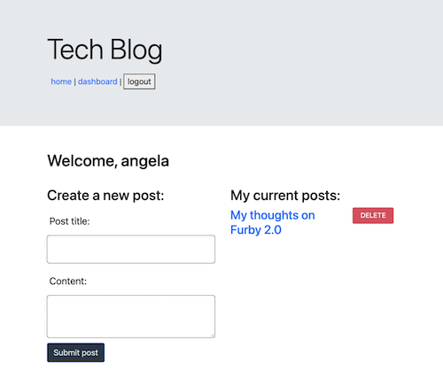
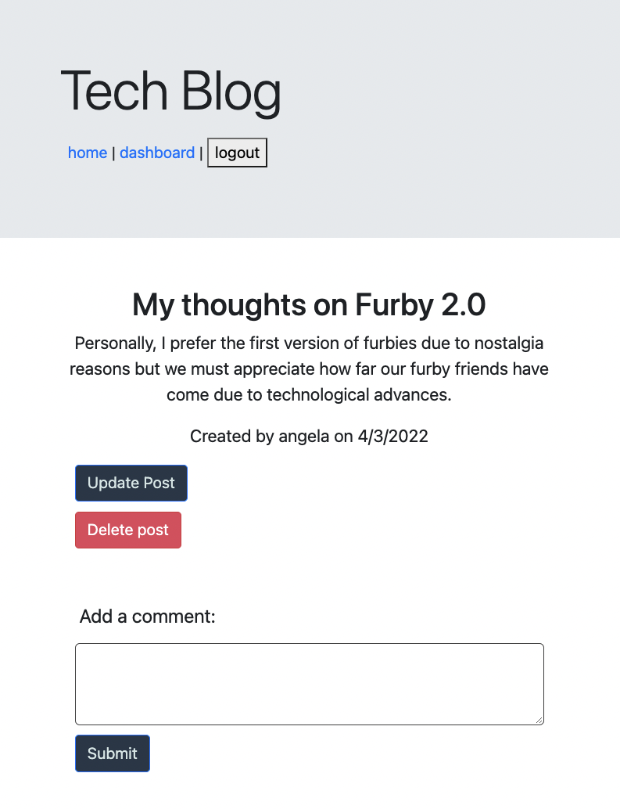

# tech-blog

## Description

Simple blog application created using express, sequelize, and handlebars as the view engine. Once a user is signed in, they are able to create posts as well as comment on other users posts. User has option to update and delete their posts. 

## Table of Contents

- [Installation](#Installation)
- [Usage](#Usage)
- [References](#Refrences)
- [License](#license)
- [Contributing](#Contributing)
- [Questions](#Questions)

## Installation

* From GitHub, fork or clone the repo. The user must have Node.js and MySQL installed. Once forked, run `npm i` from the root directory to install required dependencies
* Update session secret as well as your MySQL username and password in the `.env.EXAMPLE` file to connect to the database
* Run `SOURCE db/schema.sql` within MySQL shell in order to create the database
* Run `node seeds/index.js` to seed database
* Run `npm start` to start the server

## Usage

Once signed up and signed in, user can create a new post by navigating to their `dashboard` page. To update or delete your post, navigate to your posts page `/api/posts/:id`. There is also an option to delete your post from the dashboard page under the "My Current Posts" sidebar list.

[Click here to see the deployed app on Heroku](https://tch-blg.herokuapp.com/)

## References

* [Express](https://www.npmjs.com/package/express)
* [Sequelize](https://www.npmjs.com/package/sequelize)
* [dotenv](https://www.npmjs.com/package/dotenv)
* [Handlebars](https://www.npmjs.com/package/handlebars)
* [Insomnia](https://insomnia.rest/)
* [bcrypt](https://www.npmjs.com/package/bcrypt)

## License

This application is covered under MIT License

  

    

      License Text
    
 
 
  Copyright (c) 2022 a-donati
  
  Permission is hereby granted, free of charge, to any person obtaining a copy
  of this software and associated documentation files (the "Software"), to deal
  in the Software without restriction, including without limitation the rights
  to use, copy, modify, merge, publish, distribute, sublicense, and/or sell
  copies of the Software, and to permit persons to whom the Software is
  furnished to do so, subject to the following conditions:
        
  The above copyright notice and this permission notice shall be included in all
  copies or substantial portions of the Software.
        
  THE SOFTWARE IS PROVIDED "AS IS", WITHOUT WARRANTY OF ANY KIND, EXPRESS OR
  IMPLIED, INCLUDING BUT NOT LIMITED TO THE WARRANTIES OF MERCHANTABILITY,
  FITNESS FOR A PARTICULAR PURPOSE AND NONINFRINGEMENT. IN NO EVENT SHALL THE
  AUTHORS OR COPYRIGHT HOLDERS BE LIABLE FOR ANY CLAIM, DAMAGES OR OTHER
  LIABILITY, WHETHER IN AN ACTION OF CONTRACT, TORT OR OTHERWISE, ARISING FROM,
  OUT OF OR IN CONNECTION WITH THE SOFTWARE OR THE USE OR OTHER DEALINGS IN THE
  SOFTWARE.

  

## Contributing

Please contact me to be added as a collaborator to this project.

## Questions

- Contact me via [email](mailto:angeladonati93@gmail.com)
- View my GitHub [profile](http://www.github.com/a-donati)
